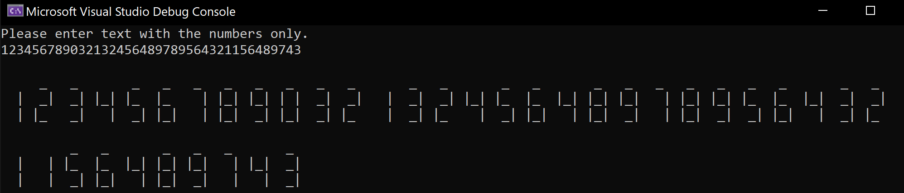

# DigitalDisplay

## About
The application is used to display a string of numbers like a digital display.

The application was created as part of a qualifying assignment for the job.

## Usage
To run in terminal: ***dotnet run***

To run tests: ***dotnet test*** 

## Screen

